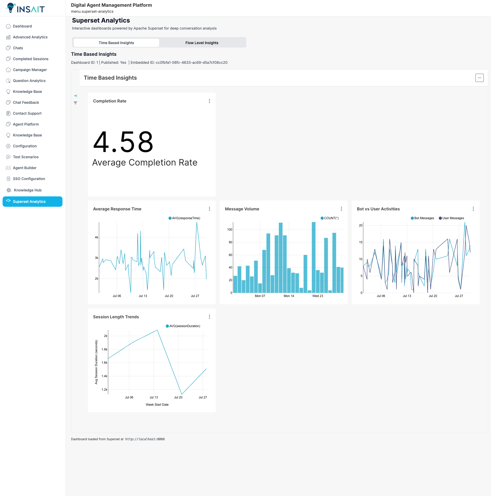

# Superset Analytics Integration - Implementation Guide

## Overview

This implementation integrates Apache Superset dashboards into the admin frontend, providing embedded analytics capabilities that automatically fetch and display published dashboards from a Superset instance.

## Backend Database Models

### Prisma Schema Models Added

The implementation introduces three core database models to support comprehensive conversation analytics:

#### 1. ClientSession Model
**Purpose**: Track user sessions and conversation lifecycle
**Key Features**:
- Session lifecycle tracking (ACTIVE, COMPLETED, ABANDONED, ERROR)
- Duration and completion metrics  
- Drop-off point analysis with `dropOffStep` tracking
- User agent and IP tracking for device insights
- Relationship with User model for user-based analytics

**Why Added**: This model enables session-level analysis by tracking complete user journeys, making it possible to calculate conversion rates, identify drop-off patterns, and measure session success rates across different user segments.

#### 2. ConversationStep Model  
**Purpose**: Track individual steps within conversations  
**Key Features**:
- Step-by-step flow tracking with entry/exit times
- Success/failure status per step with `wasSuccessful` flag
- Duration tracking for performance analysis
- Categorized step types (MESSAGE, INPUT, CHOICE, API_CALL, VALIDATION, REDIRECT)
- User input and bot response capture
- Error message logging for debugging

**Why Added**: Granular step tracking enables detailed funnel analysis, identifies bottlenecks in conversation flows, and provides insights into where users struggle or abandon the process. This is essential for optimizing conversation design and improving user experience.

#### 3. MessageLog Model
**Purpose**: Detailed message logging with metadata  
**Key Features**:
- Message type classification (TEXT, IMAGE, FILE, BUTTON_CLICK, FORM_SUBMIT, ERROR)
- Sender identification (USER, BOT, SYSTEM)
- Response time tracking for performance metrics
- Sentiment analysis integration with `sentiment` field
- Token count tracking for cost analysis
- Rich metadata storage using JSON field
- Processing status tracking

**Why Added**: Message-level analytics provide insights into conversation quality, bot performance, user sentiment, and communication patterns essential for optimization. The detailed logging enables analysis of response times, content effectiveness, and user engagement patterns.

### Model Relationships
```
User (1) -----> (Many) ClientSession
ClientSession (1) -----> (Many) ConversationStep  
ClientSession (1) -----> (Many) MessageLog
ConversationStep (1) -----> (Many) MessageLog (optional)
```

## Frontend Type Definitions

### TypeScript Interfaces Added

The implementation adds comprehensive TypeScript interfaces to support Superset integration:

```typescript
// Superset Authentication
interface SupersetAuthRequest {
  username: string;
  password: string;  
  provider: 'db' | 'ldap';
  refresh: boolean;
}

// Dashboard Structure
interface SupersetDashboard {
  id: string;                    // Dashboard ID for API calls
  dashboard_title: string;       // Display name in tabs
  url: string;                  // Dashboard URL path
  published: boolean;           // Only published dashboards are shown
}

// Embedded Configuration
interface SupersetEmbeddedConfig {
  uuid: string;                 // Embedded UUID for iframe integration
  allowed_domains: string[];    // CORS domains for embedding
}

// Guest Token Request
interface SupersetGuestTokenRequest {
  user: {
    username: string;           // Guest user identifier
    first_name?: string;
    last_name?: string;
  };
  resources: Array<{
    type: 'dashboard';          // Resource type for access control
    id: string;                 // Dashboard ID for permissions
  }>;
  rls: Array<any>;             // Row-level security rules
}
```

### Column Rationale

**Dashboard ID vs Embedded UUID**: 
- `id`: Used for API calls to fetch dashboard metadata and create guest tokens
- `uuid`: Required for actual iframe embedding - different from dashboard ID
- **Why both needed**: Superset's API uses dashboard ID, but embedding requires embedded UUID

**Published Status**:
- `published`: Ensures only production-ready dashboards are displayed
- **Business Value**: Prevents users from seeing draft or test dashboards

**Guest Token per Dashboard**:
- Each dashboard requires its own guest token for security isolation
- **Security Benefit**: Granular access control per dashboard resource

## Superset Setup Instructions

### Using Docker Commands

```bash
# 1. Navigate to superset directory
cd superset/

# 2. Start Superset with PostgreSQL
docker-compose up -d

# 3. Wait for containers to be healthy (check with docker ps)
docker ps

# 4. Initialize Superset (first time only)
docker exec -it superset_app superset db upgrade
docker exec -it superset_app superset fab create-admin \
    --username admin \
    --firstname Admin \
    --lastname User \
    --email admin@superset.com \
    --password admin

# 5. Initialize roles and permissions
docker exec -it superset_app superset init
```

### Using Makefile (if available)

```bash
# Start Superset
make superset-up

# Initialize Superset (first time)
make superset-init

# Stop Superset
make superset-down
```

### Critical Configuration Steps

#### 1. Enable Dashboard Embedding

In Superset UI:
1. Go to **Settings > Feature Flags**
2. Enable `EMBEDDED_SUPERSET` feature flag
3. Navigate to each dashboard you want to embed
4. Click **Settings > Embed Dashboard**
5. Add allowed domains: `http://localhost:5173`, `http://test-company.insait.com:5173`
6. Save the embedded configuration

#### 2. CORS Configuration

The `superset_config.py` file must include:

```python
# Enable CORS for frontend domains
CORS_OPTIONS = {
    'supports_credentials': True,
    'allow_headers': ['*'],
    'resources': ['*'],
    'origins': [
        'http://localhost:5173',
        'http://test-company.insait.com:5173'
    ]
}

# Enable embedding features
FEATURE_FLAGS = {
    'EMBEDDED_SUPERSET': True,
    'ENABLE_TEMPLATE_PROCESSING': True
}

# Disable CSRF for API calls
WTF_CSRF_ENABLED = False
TALISMAN_ENABLED = False
```

## Component Architecture

### Service Layer (`src/services/superset.ts`)

The SupersetService class handles all API interactions:

```typescript
class SupersetService {
  // 1. Authentication with admin credentials
  async authenticate(): Promise<string>
  
  // 2. Fetch all dashboards (filters for published only)  
  async getDashboards(accessToken: string): Promise<SupersetDashboard[]>
  
  // 3. Get embedded configuration UUID
  async getEmbeddedConfig(dashboardId: string, accessToken: string): Promise<SupersetEmbeddedConfig>
  
  // 4. Create guest token for dashboard access
  async createGuestToken(dashboardId: string, accessToken: string): Promise<string>
}
```

### Custom Hook (`src/hooks/useSuperset.ts`)

Manages state and provides data fetching functions:

```typescript
export const useSuperset = () => {
  // State management for dashboards, tokens, and configs
  // Automatic authentication and dashboard fetching on mount
  // Error handling and loading states
  // Token caching and refresh capabilities
}
```

### Component Workflow

#### 1. Initial Load Sequence
```
useSuperset Hook Initialization
↓
authenticate() - Get admin access token
↓  
fetchDashboards() - Get all published dashboards
↓
For each dashboard:
  ├── getEmbeddedConfig() - Get embedding UUID
  └── createGuestToken() - Generate user access token
↓
SupersetAnalytics renders dashboard tabs
```

#### 2. Dashboard Embedding Process
```
User selects dashboard tab
↓
EmbeddedDashboard component becomes active
↓
handleDashboardEmbed() called with:
  ├── Dashboard ID
  ├── Container element ID  
  ├── Embedded UUID
  └── Guest token
↓
@superset-ui/embedded-sdk embedDashboard()
↓
Iframe renders in container
```

#### 3. Token Refresh on Expiration
```
Superset authentication error detected
↓
refreshGuestToken() function:
  ├── Clear expired tokens from cache
  ├── Call createGuestToken() API
  └── Update local state
↓
Retry embedding with new token
↓
Show "Refreshing authentication..." during process
```

## Setup Pitfalls and Solutions

### 1. PostgreSQL Connection in Docker

**Problem**: Superset can't connect to PostgreSQL when both run in Docker

**Solution**: Use `host.docker.internal` as the database host:

```env
# In .env file
DATABASE_HOST=host.docker.internal
DATABASE_PORT=5432
DATABASE_DB=superset_db  
DATABASE_USER=superset
DATABASE_PASSWORD=superset
```

**Why**: Docker containers can't reach `localhost` - they need the special Docker hostname to access host services.

### 2. CORS Blocking Frontend Requests

**Problem**: Browser blocks API calls with CORS policy errors

**Solution**: Configure Superset CORS origins in `superset_config.py`:

```python
CORS_OPTIONS = {
    'origins': [
        'http://localhost:5173',           # Vite dev server
        'http://test-company.insait.com:5173'  # Custom domain
    ]
}
```

### 3. CSRF Token Errors

**Problem**: Guest token API returns "CSRF token missing" error

**Solution**: Disable CSRF in Superset config:

```python
WTF_CSRF_ENABLED = False
```

**Caution**: Only disable in development/trusted environments.

### 4. Dashboard Not Embedding

**Problem**: Dashboard shows as blank iframe or fails to load

**Checklist**:
- Dashboard is published in Superset
- Embedded configuration exists with correct domains
- Guest token created successfully
- Using embedded UUID (not dashboard ID) for embedding
- Container element exists in DOM

### 5. Rate Limiting Issues

**Problem**: Too many API calls trigger Flask rate limits

**Solution**: Implement request throttling:

```typescript
// Add delays between API calls
await new Promise(resolve => setTimeout(resolve, 200));
```

### 6. Multiple API Calls

**Problem**: Guest token API called repeatedly causing performance issues

**Solution**: Implement comprehensive caching:

```typescript
// Global token cache
const globalGuestTokenCache = new Map<string, string>();
const tokenFetchingInProgress = new Set<string>();

// Check cache before making API calls
if (globalGuestTokenCache.has(dashboardId)) {
    return globalGuestTokenCache.get(dashboardId);
}
```

## Environment Variables

### Frontend (.env)
```env
VITE_SUPERSET_BASE_URL=http://localhost:8088
VITE_SUPERSET_USERNAME=admin  
VITE_SUPERSET_PASSWORD=admin
```

### Superset (.env)
```env
DATABASE_HOST=host.docker.internal
DATABASE_PORT=5432
DATABASE_DB=superset_db
DATABASE_USER=superset
DATABASE_PASSWORD=superset
REDIS_HOST=localhost
REDIS_PORT=6379
```

## Component Features

### Dashboard Tab Interface
- Displays up to 4 published dashboards as tabs
- Follows existing Analytics.tsx design patterns  
- Responsive grid layout for tab triggers
- Loading states during dashboard embedding

### Authentication Management  
- Automatic admin login using environment credentials
- Guest token generation per dashboard for security
- Token expiration detection and automatic refresh
- Error handling with user-friendly messages

### Performance Optimizations
- Global token caching to prevent duplicate API calls
- Request throttling to avoid rate limiting
- Iframe sizing optimization for full container usage
- Tab switching optimization to prevent re-embedding

This implementation provides a scalable foundation for embedded Superset analytics while handling the complexities of authentication, CORS, and token management automatically.

## Expected Dashboard Output

When the implementation is configured correctly, users will see embedded Superset dashboards rendered within the admin frontend. The system supports multiple dashboard tabs with comprehensive analytics.

### Flow Level Insights Dashboard

The Flow Level Insights dashboard provides conversation flow analytics with the following key metrics:


**Key Features Displayed:**
- **Completion Rate**: Shows average completion rate (4.12) indicating overall conversation success
- **Drop-off Analysis**: Bar chart showing where users abandon conversations at different steps
- **Steps per Conversation**: Average steps per conversation (8.42) for flow complexity analysis
- **Session Duration Distribution**: Histogram showing session length patterns across different time ranges
- **Status Breakdown**: Pie chart displaying session status distribution (Active, Abandoned, Completed, Error)
- **Steps Success Rate**: Bar chart showing success rates by step type (API Call, Input, Redirect)

### Time Based Insights Dashboard

The Time Based Insights dashboard (similar layout to Flow Level) focuses on temporal patterns and performance metrics:



**Expected Functionality:**
- **Tab Navigation**: Two-tab interface allowing users to switch between "Flow Level Insights" and "Time Based Insights"
- **Responsive Layout**: Dashboard adjusts to container size with proper iframe scaling
- **Interactive Charts**: All Superset chart interactions (filtering, drill-down, tooltips) work within the embedded iframe
- **Real-time Data**: Charts display actual data from the ClientSession, ConversationStep, and MessageLog models
- **Dashboard Metadata**: Shows dashboard ID, published status, and embedded ID for transparency

### Integration Success Indicators

When everything is working correctly, you should observe:

1. **Sidebar Navigation**: "Superset Analytics" menu item appears with the custom superset icon
2. **Tab Interface**: Clean tab layout following the existing Analytics.tsx design patterns
3. **Dashboard Loading**: Smooth loading states with spinner during dashboard initialization
4. **Authentication**: Automatic guest token generation and refresh without user intervention
5. **Error Handling**: Graceful error display with retry options if dashboards fail to load
6. **Performance**: Dashboards load within 3-5 seconds with proper caching
7. **Responsive Design**: Dashboards scale properly on different screen sizes

The embedded dashboards should seamlessly integrate with the existing admin panel design, providing powerful analytics capabilities while maintaining the native application experience.